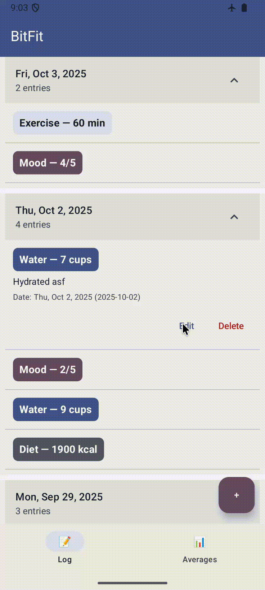

# Android Project 5 - *BitFit*

Submitted by: **Syrr Gordon**

**BitFit** is a health metrics app that allows users to track your:
- diet
- mood
- water intake,
- and exercise habits.

Time spent: **3.5** hours spent in total

## Required Features

The following **required** functionality is completed:

- [X] **At least one health metric is tracked (based on user input)**
  - Chosen metric(s): `diet, mood, water intake, and exercise`
- [X] **There is a "create entry" UI that prompts users to make their daily entry**
- [X] **New entries are saved in a database and then updated in the RecyclerView**
- [X] **On application restart, previously entered entries are preserved (i.e., are *persistent*)**
 
The following **optional** features are implemented:

- [X] **Create a UI for tracking averages and trends in metrics**
- [X] **Improve and customize the user interface through styling and coloring**
- [X] **Implement orientation responsivity**

The following **additional** features are implemented:

- [X] 4 trackable health metrics
  - Water Intake
  - Caloric Intake
  - Mood
  - Exercise
- [X] Data Persistence After Restart
- [X] Mutable Entries
  - All fields of an entry can be edited post-creation
  - Entries can be deleted entirely
- [X] User-friendly UI (+ stretch goals)
  - "Create entry" component that prompts users to make their daily entry
  - Styilized/colorized UI
  - *Entries are collapsible to save space on your screen*
- [X] Date Categorized Logs
  - Dates can be attached to entries (including past dates!)
  - Entries are grouped by date within the RecyclerView
- [X] Orientation Responsivity

## Video Walkthrough

Here's a walkthrough of implemented user stories:

*Proof of data persisting after restart:*

*Proof of editable entries and date dialog:*

GIF created with:
- QuickTime Player to screen record.
- [CloudConvert](https://cloudconvert.com/mov-to-gif) to convert .mov to .gif.

## License

    Copyright 2025 Syrr Gordon

    Licensed under the Apache License, Version 2.0 (the "License");
    you may not use this file except in compliance with the License.
    You may obtain a copy of the License at

        http://www.apache.org/licenses/LICENSE-2.0

    Unless required by applicable law or agreed to in writing, software
    distributed under the License is distributed on an "AS IS" BASIS,
    WITHOUT WARRANTIES OR CONDITIONS OF ANY KIND, either express or implied.
    See the License for the specific language governing permissions and
    limitations under the License.